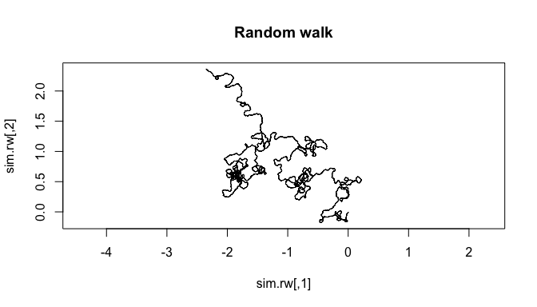
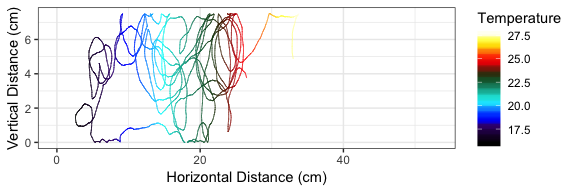
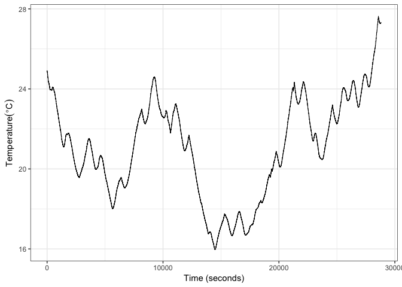
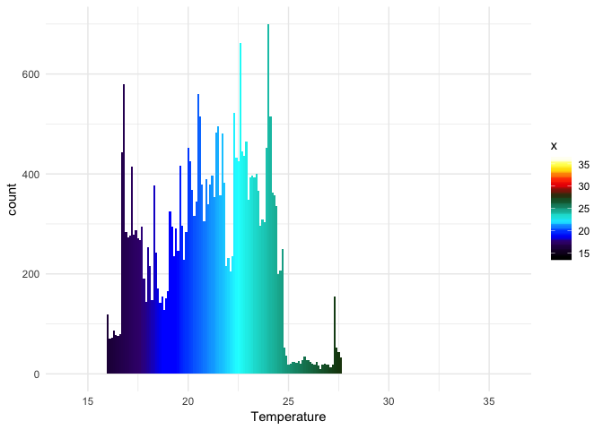
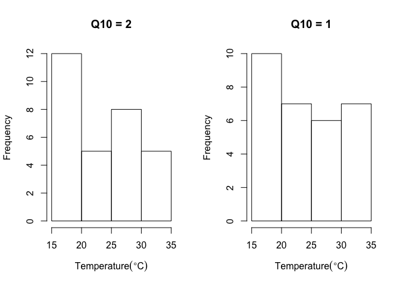

Randomly Crawling Snails: Modelling Null Distributions in Thermal Gradients
===========================================================================

We recently published a paper on behavioural thermoregulation in snails
infected with parasite trematodes:

 

*Wang, SYS, Tattersall, GJ, and Koprivnikar, J. 2019. Trematode parasite
infection affects temperature selection in aquatic host snails.
Physiological and Biochemical Zoology, 92(1):71–79.*

<http://www.journals.uchicago.edu/doi/abs/10.1086/701236>

 

As we were assessing behavioural thermoregulation using a rectangular
tank that had a linear temperature gradient along the floor, and because
snails are rather slow moving, we wanted to compare the exploration of
this environment to that of a null model for movement.

(<https://github.com/gtatters/RandomCrawl/blob/master/Data/Active.gif>)

("<https://github.com/gtatters/RandomCrawl/blob/master/Data/Inactive.avi>")

Null models are important in behavioural thermoregulation studies since
they allow us to assess how the animal would behave if it were not
orienting specifically with respect to temperature. Ectothermic animals,
whose body temperature depends on the local ambient temperature, would
be prone to move more slowly at cold temperatures, and more rapidly at
higher temperatures simply due to Arhennius (Q10) effects on muscle
function. Thus, we want to understand how a randomly crawling snail
would behave when exposed to a thermal gradient. In other words, what
would the null distribution be for random movement? This null
distribution can then be compared to real animal distributions and allow
us to conclude whether preference or random movement explains the
results.

There are many packages in R that allow for random walks. Here is SiMRiv
in action:

    library("SiMRiv")
    rand.walker <- species(state(concentration=0.98, steplen=mean(0.001)))
    sim.rw <- simulate(rand.walker, 28800)
    plot(sim.rw, type = "l", asp = 1, main = "Random walk")

 

But none of the packages had boundary limits and options for allowing
flexible displacement (i.e. movement velocity that depends on location)
functions required for our experiment. So, I have made my own function
(*sim.snail*) to generate random movement within a thermal gradient.

Required libraries
==================

We'll need the following libraries active for this demonstration.

    library(Thermimage)
    library(ggplot2)
    library(CircStats)

 

 

A null model of movement in a constrained enviroment
====================================================

Define Input Parameters
-----------------------

Set the X,Y limits (MaxX, MinX, MaxY, MinY):

    MaxX=53
    MinX=0
    MaxY=7.5 
    MinY=0

Define how many steps (Steps, by default, we assume each step is 1
second in duration, but this is arbitrary). 28800 sec = 8 hours:

    Steps=28800

Probability of stopping (Pstop, for each step, what is the probability
of stopping. Stopping will allow for movement trajectory, theta, to be
reset):

    Pstop=0.001

Regression parameters describing the thermal gradient along the x axis:

    b=15
    m=0.37383
    g<-expand.grid(x=seq(0,53.5,0.01), y=seq(0,7.5,0.1))
    g$Temperature<-15+0.37383*g$x

Which looks a little bit like this:

    ggplot(g, aes(x=x, y=y))+geom_raster(aes(fill = Temperature)) +
      scale_fill_gradientn(colours = rainbow1234pal)+
      xlab("Longitudinal Axis, X")+ylab("Vertical Axis, Y")+
      theme_minimal()

 

Define temperature sensitivity of movement (*Q*10) and the
reference temperature for movement velocities:

    Q10=2
    Tref=22

Which would look like the following:

    Temperature<-15:35
    v<-0.01
    dz<-v* 10^(log10(Q10)*(15:35-Tref)/10) 
    plot(dz~Temperature, ylab="Velocity (cm/s)")

Movement velocity, Vels, is supplied as a vector of measured movements
(cm/s). Our measurements have snails in a constant environment with a
Velocity of 0.01077 cm/s.

We do this using empirical data later on, but it could be provided as a
random number:

    Vels<-rnorm(n=100, mean=0.0128, sd=0.009478002)

Or we can load in data collected on ~124 snails:

    d<-read.csv("SnailStats.csv")
    mean(d$Vel_mean)

    ## [1] 0.01077137

    sd(d$Vel_mean)

    ## [1] 0.009478002

    Vels<-d$Vel_mean

Then we need to provide information on turning angles (alpha). We do
this by asking for a mean turning angle, mua (likely zero, but you can
model an animal with a turning bias, or derive this from empirical
measurements). We use circular statistics to calculate the mean and
concentration factor of the alpha values (rho):

    circ.mean(d$Alpha_circmean)

    ## [1] 0.004038951

    mua<-circ.mean(d$Alpha_circmean)
    est.rho(d$Alpha_circmean)

    ## [1] 0.9998546

To allow for angles to be drawn at random, we also need information on
the variance possible with the turning angle. For circular statistics,
this is often called the displacement or rho value. Distributions of
angles cannot be drawn from the *rnorm* function in base R. Instead we
use circular statistics to draw a "wrapped normal" distribution, with
mean = mua and rho set as the concentration factor (must be between 0
and 1):

    par(mfrow=c(1,3))
    anga<-rwrpnorm(10000, mu=mua, rho=0.5)
    hist(anga,breaks=1000, xlim=c(0,6.2), ylim=c(0,120), xlab="Turning angle (radians)",
         main="rho = 0.5")
    anga<-rwrpnorm(10000, mu=mua, rho=0.9)
    hist(anga,breaks=1000, xlim=c(0,6.2), ylim=c(0,120), xlab="Turning angle (radians)",
         main="rho = 0.9")
    anga<-rwrpnorm(10000, mu=mua, rho=0.98)
    hist(anga,breaks=1000, xlim=c(0,6.2), ylim=c(0,120), xlab="Turning angle (radians)",
         main="rho = 0.98")

Let's set the rhoa to 0.999 (similar to what we found empirically),
which is quite high, but will allow the random snail to move mostly in a
straight line:

    rhoa<-0.999

Finally, determine what *rhostop* and *rhowall* should be. *rhostop*
simply means that anytime the snail stops, its turning angle, alpha, can
be drawn from a distribution with higher or lower variance. *rhowall*
defines what the concentration factor should be for when the snail
reaches the wall. If your rho is too high, the snail has no chance of
"bouncing" off the wall. Also, once the snail hits the wall, it's
subsequent trajectory is drawn from angles that will be parallel to the
present boundary, with *rhowall* as the concentration factor for a
bimodal wrapped normal distribution. In other words, anytime the model
would otherwise push the snail outside the boundary, it is encouraged to
move along the boundary. If you set rhowall to a high value, you should
see wall hugging behaviour.

Let's set the *rhostop* to be 50% of the *rhoa* value and set *rhowall*
simply to be 0.9:

    rhostop<-0.5*rhoa
    rhowall<-0.9

Using the *sim.snail* function
------------------------------

With all these parameters in place, we can call the function. The
function *sim.snail()* in the R folder should create a random walk snail
moving at velocity (cm/s), randomly drawn from a distribution of known
movement velocities.

It starts by assuming the initial trajectory (theta) is random (between
0 and 2pi radians) with the origin set to (MaxX-MinX)/2 and
(MaxY-MinY)/2.

Subsequently, for each step in the random process, velocity is be drawn
from the range of velocities provided and depending on the present
temperature, a *Q*10-corrected velocity is used (warmer
temperatures will have faster velocities).

Alpha is the turning angle and used to indicate how much the trajectory
is allowed to change. An Alpha with a high rho is restricted, while a
low rho value is much more random.

For each step, the trajectory and displacement are both calculated and
added to the previous position to determine the new position.

Boundaries are provided to keep the walk within a known spatial limit.
When a new X or Y would fall outside the boundary, a new random angle is
drawn to reflect off the wall at random.

Finally, *export* can be set to "path" or "meanlasthour". "path" will
return a data frame with the X,Y,theta, and temperature for all 28800
steps. "meanlasthour" simply returns the mean temperature in the last
hour, which we used during a replication process.

Sample Output of the Random Crawl
---------------------------------

    res<-sim.snail(MaxX=MaxX, MinX=MinX, MaxY=MaxY, MinY=MinY, Pstop=Pstop, Steps=Steps,
                    Vels=Vels, b=b, m=m, Q10=Q10, Tref=Tref, mua=mua, rhoa=rhoa, 
                    rhostop=rhostop, rhowall=rhowall, export="path")
    ggplot(res, aes(x=X, y=Y, col=Temperature))+
      geom_path(size=0.3)+xlim(0,53)+ylim(0,7.5)+
      scale_color_gradientn(colors=rainbow1234pal)+
      xlab("Horizontal Distance (cm)")+
      ylab("Vertical Distance (cm)")+
      theme_bw()

 

Resulting Temperatures from the Random Crawl
--------------------------------------------

Here is what a resulting Temperature would look like:

    ggplot(res, aes(x=1:nrow(res), y=Temperature))+
      geom_path(size=0.3)+
      #xlim(0,53)+ylim(0,8)+
      scale_color_gradientn(colors=ironbowpal)+
      xlab("Time (seconds)")+
      ylab(expression("Temperature" ( degree*C)))+
      theme_bw()

    ggplot(res, aes(x=Temperature, fill=..x..))+
        geom_histogram(binwidth = 0.1)+  xlim(14,36)+
        scale_fill_gradientn(colors=rainbow1234pal)+theme_minimal()

 

Estimate Null Selected Temperature Distribution
-----------------------------------------------

### Replicate the Crawl

Having devised a means to model a random walk within the contraints of
the experiment, now we need to replicate this. One run of the function
only shows an n=1 for the random walk, and for our purposes, we were
interested in where the null model 'ends', and the distribution of
temperatures over the last hour of the random walk. This was related to
our biological question.

Technically we want to replicate this 1000 to 10000 times to assess the
empirical distribution, but the code is slow and best run using parallel
computing. Below we'll create another function with an adjustable
*Q*10, and run 30 replicates for each, since the time
required is very long:

    rep_sim.snail<-function(Q10=2){
      res<-sim.snail(MaxX=MaxX, MinX=MinX, MaxY=MaxY, MinY=MinY, Pstop=Pstop, Steps=Steps,
                      Vels=Vels, b=b, m=m, Q10=Q10, Tref=Tref,
                      mua=mua, rhoa=rhoa, rhostop=rhostop,
                      rhowall=rhowall, export="meanlasthour")
      return(res)
    }

    res2<-replicate(30, rep_sim.snail(Q10=2))
    res1<-replicate(30, rep_sim.snail(Q10=1))
    par(mfrow=c(1,2))
    hist(res2, main="Q10 = 2", xlim=c(15,35), xlab=expression("Temperature" ( degree*C)))
    hist(res1, main="Q10 = 1", xlim=c(15,35), xlab=expression("Temperature" ( degree*C)))

So, with only a few replications, it is apparent that temperature
sensitivity predicts random clustering toward the cold end, as the crawl
speed slows down in the cold, leading to more time spent in the cold.
But maybe this is a sampling error, so in the next section I'll show
results from many more replications.

### Final Replications

Unfortunately the code is slow (since it is not fully vectorised) so
we'll load in randomisations previously run and saved and plot the
distributions for 10,000 randomisations:

    load("~/Dropbox/R/MyProjects/RandomCrawl/Data/Q10_1_VelsActiveDist.rda")
    load("~/Dropbox/R/MyProjects/RandomCrawl/Data/Q10_2_VelsActiveDist.rda")

    ggplot(data.frame(Q10_1_VelsActiveDist), aes(x=Q10_1_VelsActiveDist, fill=..x..))+
        geom_histogram(binwidth = 0.1)+
        xlim(14,36)+
        ggtitle("Q10 = 1")+
        xlab(expression("Temperature" ( degree*C)))+
        scale_fill_gradientn(colors=rainbow1234pal)+theme_minimal()

    ## Warning: Removed 43 rows containing non-finite values (stat_bin).

    ggplot(data.frame(Q10_2_VelsActiveDist), aes(x=Q10_2_VelsActiveDist, fill=..x..))+
        geom_histogram(binwidth = 0.1)+
        xlim(14,36)+
        ggtitle("Q10 = 2")+
        xlab(expression("Temperature" ( degree*C)))+
        scale_fill_gradientn(colors=rainbow1234pal)+theme_minimal()

    ## Warning: Removed 283 rows containing non-finite values (stat_bin).

The primary difference here is that temperature sensitive movement
predicts accumulation at lower temperatures.
